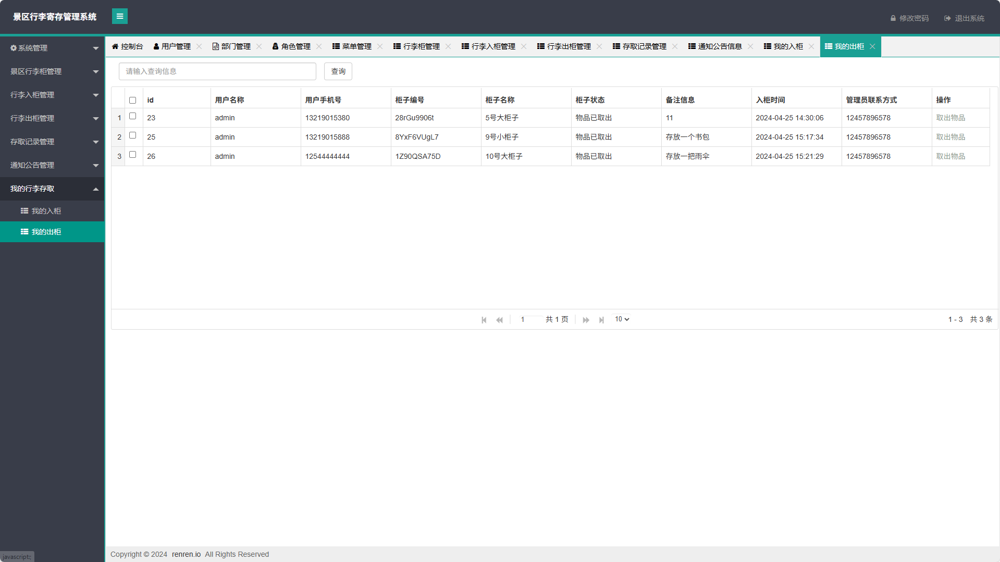

# 景区行李寄存管理系统(文末获取方式☟)
> 
#### 介绍
景区行李寄存管理系统(Java_SpringBoot)
有BUG可留言加微

#### 软件架构
Java + SpringBoot + Mybatis + Mysql

#### 项目功能说明

1.  管理员功能
> + 系统管理：用户管理、部门管理、角色管理、菜单管理
> + 景区行李柜管理：行李柜管理
> + 行李入柜管理
> + 行李出柜管理
> + 存取记录管理
> + 通知公告管理
> + 我的行李存取：我的入柜、我的出柜
2.  用户功能
> + 通知公告管理
> + 我的行李存取：我的入柜、我的出柜

### 部分功能演示

### 环境需求(可免费提供)
- idea/eclipse、jdk-1.8、maven-3.8.6、mysql、node.js等

## 有项目修改、安装调试需求 请联系以下

## 获取资源扫☝☝☝

